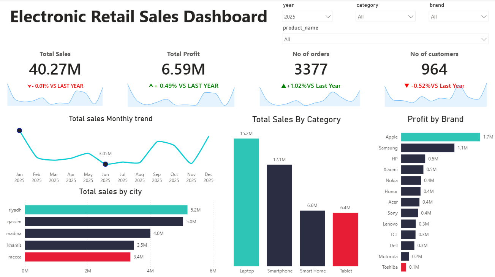

# 📊 Electronic Retail Sales Analysis Dashboard

An interactive Power BI dashboard analyzing electronic retail sales performance across products, categories, brands, and cities — built to track sales, profit, and customer trends over time.



## 🔍 Overview

This dashboard provides a 360° view of electronic retail performance, combining high-level KPIs with detailed breakdowns by product, category, brand, and geography. It's designed to help stakeholders quickly spot trends, top performers, and areas that need attention.

## 📌 Key Metrics (KPIs)

| Metric | Value | YoY Change |
|---|---|---|
| Total Sales | 40.27M | ▲ +1.76% |
| Total Profit | 6.56M | ▲ +1.23% |
| No. of Orders | 3,343 | ▲ +1.92% |
| No. of Customers | 969 | ▲ +0.83% |

## 🖥️ Dashboard Pages

### 1. Sales Overview
- **Total Sales Monthly Trend** — tracks sales performance across all 12 months, highlighting peak and low points.
- **Total Sales by Category** — compares Laptop, Smartphone, Smart Home, and Tablet performance (Laptop leads at 15.8M).
- **Total Sales by City** — geographic breakdown across Qassim, Riyadh, Khamis, Mecca, and Abha.
- **Brands Profitability** — ranks brands (Apple, Samsung, HP, Xiaomi, and more) by profit contribution.

### 2. Product Performance
- **Top 5 Selling Products** — best-selling SKUs by total sales value.
- **Top 5 Performing Products (Sales & Profit)** — side-by-side comparison of profit vs. sales per product.
- **Sales vs. Profit Scatter Plot** — correlation analysis across categories to spot high-margin vs. high-volume products.


## ✨ Key Features & Technical Highlights

* **Dynamic KPI Cards:** Custom KPI visuals enhanced with monthly **Sparklines** and Year-over-Year (YoY) performance metrics (`% VS LAST YEAR`).
* **Advanced Conditional Formatting:** Highlighted Top/Bottom performers dynamically (e.g., Apple vs. Toshiba / Top vs. Bottom products) to minimize cognitive load.
* **Correlation Analysis:** Implemented a **Sales vs. Profitability Scatter Plot** categorized by product segment (`Laptop`, `Smartphone`, `Smart Home`, `Tablet`) to identify high-margin vs. volume-driven assets.
* **Custom Dynamic DAX Measures:** Used advanced Time Intelligence and dynamic context-aware measures for highlight markers on trends.

## 🎛️ Filters / Slicers

The dashboard supports dynamic filtering by:
- **Year**
- **Category**
- **Brand**
- **Product Name**

## 🛠️ Tools Used

- **Power BI Desktop** — data modeling, DAX measures, and visualization
- **DAX** — for KPI calculations and YoY comparisons

## 📂 Repository Contents

```
electronic-retail-sales-analysis/
├── README.md
├── dashboard.pbix          # Power BI project file
├── images/                 # Dashboard screenshots
│   ├── dashboard-overview.png
│   └── dashboard-details.png
└── data/                   # Sample/source data (if applicable)
```

## 🚀 How to View

1. Clone or download this repository.
2. Open `dashboard.pbix` using [Power BI Desktop](https://powerbi.microsoft.com/desktop/) (free download).
3. Explore the dashboard using the interactive filters.

> Don't have Power BI installed? Check the `images/` folder for full dashboard screenshots.

## 📈 Key Insights

- Laptops are the top-performing category, generating **15.8M** in sales — nearly 2.5x the next closest category.
- Sales showed a strong recovery in Q4 2024, peaking at **3.74M** in December after a dip in May.
- Apple and Samsung are the most profitable brands, together contributing over **2.8M** in profit.
- Qassim is the top-performing city by sales, followed closely by Riyadh.

## 📬 Contact

Feel free to reach out with questions or feedback about this project.

---
⭐ If you found this dashboard useful, consider giving the repo a star!
